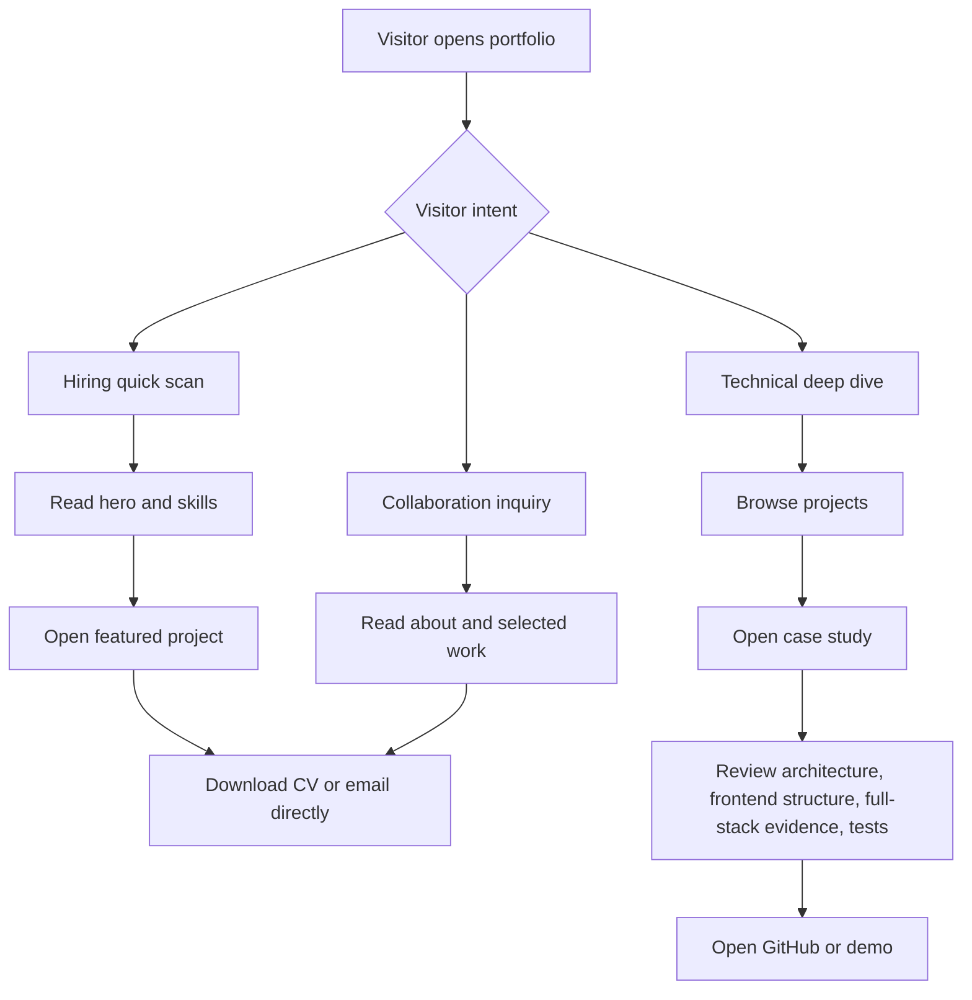

# Jerome Portfolio PRD

## V1 交付决策（2026-07-17）

- 市场定位统一为 Full Stack Engineer，以 Node.js / NestJS / Express 和 .NET 后端能力为主，React、Next.js、React Native 作为完整产品交付的一部分。
- 首批深度案例为 Carsome、Pintec、Mealway，中英文同步发布；RateEverything 保留为次级独立产品案例。
- Projects V1 使用 `Professional Work / Independent Products` 紧凑分组列表。项目超过 6 个且筛选能明显降低查找成本后，再实现复杂筛选。
- About 覆盖职业路径、工程原则、当前方向和中英双语协作；Contact 只提供 availability、Email、LinkedIn、GitHub 和真实 CV。
- 发布范围包括 metadata、Open Graph、canonical、hreflang、sitemap、robots、404、结构化数据，以及 CTA、项目、CV 点击事件。

## 1. 产品目标

### 背景

Jerome 希望做一个个人 Portfolio，让更多人看见自己。真实需求不是单纯“展示前端能力”，而是解决一个更难的问题：全栈能力往往藏在系统内部，无法像 UI 截图一样被立刻看见。因此网站必须用优秀的设计能力、清晰的信息架构、可维护的前端结构、深度项目叙事和中英双语表达，把 Jerome 的端到端能力转化为访问者能快速理解和信任的证据。

### 产品定位

一个以工程可信度和设计表达力为核心的双语个人 Portfolio 网站，重点呈现 Jerome 的全栈交付能力、产品思考能力、前端结构能力、设计审美和真实项目成果。

### 目标

- 让访问者在 3 分钟内判断 Jerome 是否值得联系。
- 用设计质量、前端结构和 case study 把难以直接展示的全栈能力显性化。
- 把项目经历从 CV bullet 升级为可浏览、可验证、可讨论的 case study。
- 用完整中英双语内容展示 Jerome 的跨文化沟通能力。
- 支持招聘、面试、合作、个人品牌沉淀四类长期场景。

### 非目标

- 首版不做复杂 CMS 后台。
- 首版不做 contact form，直接使用 email、LinkedIn、GitHub 和 CV 下载。
- 首版不追求大量博客内容。
- 首版不做过度炫技的 3D/动画站，除非服务于项目展示。
- 首版不收集敏感用户数据。

## 2. 目标用户

| 用户角色 | 核心目标 | 时间预算 | 需要看到的证据 |
| --- | --- | --- | --- |
| 招聘经理 | 判断是否值得进入面试 | 1-3 分钟 | 定位、技能、经历、CV、联系方式 |
| 技术负责人 | 判断技术深度和项目质量 | 5-15 分钟 | case study、架构、代码、测试、性能 |
| 面试官 | 找到面试讨论素材 | 5-20 分钟 | 项目难点、技术取舍、本人贡献 |
| 合作伙伴/客户 | 判断是否可信并可合作 | 3-8 分钟 | 交付案例、沟通方式、完整能力 |
| 工程同行 | 学习或建立连接 | 5-15 分钟 | 技术文章、项目链接、GitHub |

## 3. 用户需求清单

### 显性需求

- 需要一个 portfolio，让更多人看见 Jerome。
- 需要通过设计和前端结构让全栈能力更容易被看见。
- 需要体现真实项目和技能栈。
- 需要可被招聘方快速理解。
- 需要中英双语版本，展示双语沟通能力。

### 隐性需求

- 需要建立信任，而不是只堆技术名词。
- 需要区分不同访问者路径：招聘快速看，技术深入看。
- 需要强调 Jerome 的独特组合：全栈交付 + 产品判断 + 前端结构 + 跨端经验 + 双语沟通。
- 需要让网站本身成为设计能力和前端工程结构的作品。
- 需要长期可维护，方便持续加入项目、文章和版本更新。
- 需要 SEO、性能、响应式和可访问性，减少职业机会流失。
- 需要避免无收益功能，例如 contact form 带来的垃圾信息、邮件服务、验证和隐私处理成本。

## 4. 功能列表

| 模块 | 功能 | 说明 |
| --- | --- | --- |
| 首页 | 个人定位首屏 | 姓名、角色、价值主张、所在地、关键技术、CTA |
| 首页 | 双语切换 | EN / 中文入口清晰可见，展示双语身份 |
| 首页 | 代表项目精选 | 展示 3-4 个最能证明能力的项目 |
| 首页 | 技术能力摘要 | 全栈、前端结构、跨端、测试、DevOps |
| 首页 | 设计与结构展示 | 用高级视觉层级、组件组织、响应式细节体现前端设计能力 |
| 关于我 | 个人故事 | 简洁说明职业路径、工程风格、当前目标 |
| 项目案例 | Case study 列表 | V1 按职业项目和独立产品分组；项目超过 6 个后再增加筛选 |
| 项目详情 | 问题-方案-结果 | 背景、目标、角色、架构、难点、结果 |
| 项目详情 | 全栈证据链 | UI、状态、API、数据、测试、部署如何协同 |
| 项目详情 | 证据链接 | Live demo、GitHub、截图、架构图、测试说明 |
| 技能矩阵 | 技能分组 | React/Next.js/TypeScript、React Native、Backend、Testing 等 |
| 经历 | Timeline | 工作经历和教育经历，避免复制完整 CV |
| 联系 | Direct links | Email、LinkedIn、GitHub、CV 下载，不做 contact form |
| 国际化 | EN/ZH | 中英双语均为一等内容 |
| 基础分析 | 访问事件 | 记录 CTA、下载、项目点击，不采集敏感数据 |

## 5. MoSCoW 优先级

### Must Have

- 首页首屏：定位、核心能力、CTA。
- 完整中英双语内容，导航、项目、关于、CTA 都支持 EN/ZH。
- 明确不做 contact form，仅提供 email、LinkedIn、GitHub、CV 下载。
- 项目 case study：Carsome、Pintec、Mealway 三篇完整双语案例，以及 RateEverything 次级案例。
- CV 下载、Email、LinkedIn、GitHub 链接。
- 响应式布局，覆盖 mobile/tablet/desktop。
- SEO metadata、Open Graph、基础可访问性。
- 数据驱动内容结构，项目和技能不硬编码在页面逻辑里。
- 前端结构展示：组件化内容区块、稳定 layout、清晰状态、可扩展 i18n 数据模型。

### Should Have

- 项目超过 6 个后的筛选和标签系统。
- 技术栈矩阵和能力分层。
- 每个项目的架构图或任务流图。
- 页面过渡和微交互动效。
- 基础 analytics 事件。
- 视觉设计系统：颜色、字体、间距、组件状态、图标风格形成一致规范。

### Could Have

- 交互式 demo 区域。
- 博客/工程笔记。
- 面向不同岗位的定制入口，例如 Frontend / Full Stack / React Native。
- 暗色模式。
- 项目截图灯箱。

### Won't Have In V1

- 登录系统。
- 评论系统。
- Contact form。
- 复杂 CMS。
- 付费服务页。
- 用户账号和个人数据存储。

## 6. 核心使用场景

### 场景 A：招聘经理快速判断

1. 从 CV、LinkedIn 或搜索结果打开网站。
2. 看到 Jerome 的定位、双语能力和关键能力。
3. 浏览精选项目和技能摘要。
4. 下载 CV 或点击 LinkedIn / Email。

成功标准：3 分钟内知道 Jerome 是否匹配岗位。

### 场景 B：技术负责人深度验证

1. 打开项目列表。
2. 进入 RateEverything 或 Te Kemu Arapū case study。
3. 查看架构、前后端边界、技术栈、本人贡献、难点和测试策略。
4. 打开 GitHub / live demo。

成功标准：能基于项目提出面试问题，并相信 Jerome 有端到端交付经验。

### 场景 C：移动端临时浏览

1. 在手机上打开链接。
2. 快速滑动首页。
3. 点击 sticky email / LinkedIn / download CV。

成功标准：移动端没有文字拥挤、CTA 可见、加载快。

### 场景 D：合作伙伴建立信任

1. 通过介绍或社交平台打开网站。
2. 查看关于我和代表项目。
3. 了解 Jerome 可做的产品和技术范围。
4. 通过 Email 联系。

成功标准：网站表达专业、稳定、可信。

## 7. 核心路径

### 3 分钟路径

```text
Landing -> Hero positioning -> Bilingual signal -> Featured projects -> Skills summary -> Email / Download CV
```

### 15 分钟路径

```text
Landing -> Projects -> Case study detail -> Architecture / evidence -> About -> Email / LinkedIn
```

### 面试路径

```text
Landing -> Project detail -> Challenge -> Technical decision -> Result -> GitHub / Demo
```

## 8. 信息架构草图

### 站点地图

```text
/
├── Home
│   ├── Hero
│   ├── Language Switch
│   ├── Featured Projects
│   ├── Skill Highlights
│   ├── Design & Frontend Structure Signal
│   ├── Experience Snapshot
│   └── Direct Contact CTA
├── /projects
│   ├── Filters
│   └── Project Cards
├── /projects/[slug]
│   ├── Overview
│   ├── Problem
│   ├── My Role
│   ├── Solution
│   ├── Architecture
│   ├── Frontend Structure
│   ├── Full-stack Evidence Chain
│   ├── Testing & Quality
│   ├── Results
│   └── Links
├── /about
│   ├── Story
│   ├── Engineering Principles
│   └── Current Focus
├── /experience
│   ├── Work Timeline
│   └── Education
├── /writing
│   └── Articles, optional in V1
└── /contact
    ├── Email
    ├── LinkedIn
    ├── GitHub
    └── CV Download
```

### 任务流



## 9. 边界与异常

| 情况 | 预期处理 |
| --- | --- |
| Live demo 链接失效 | 显示备用截图、说明状态、保留 GitHub/案例内容 |
| GitHub 项目为私有 | 显示架构和贡献说明，不展示敏感代码 |
| 项目结果缺少量化数据 | 使用可验证的交付结果，不编造指标 |
| 移动端屏幕很窄 | CTA 换行，卡片单列，技术标签可横向滚动或换行 |
| 图片加载失败 | 提供 alt text 和占位背景 |
| 用户不懂技术 | case study 顶部先提供非技术摘要 |
| 技术用户想深入 | 提供 architecture、decision、testing、links |
| CV 文件过期 | 页面显示更新时间，下载链接指向最新文件 |
| 用户想通过表单联系 | 不提供表单，明确展示 email、LinkedIn、GitHub |
| 中英文内容不同步 | 标记 fallback 语言，但 V1 发布前必须保证核心路径双语完整 |
| 无 JS 或脚本失败 | 基础内容仍可阅读，核心链接仍可点击 |

## 10. 数据结构

### Project

```ts
type Project = {
  slug: string;
  title: LocalizedText;
  subtitle: LocalizedText;
  status: "live" | "in-progress" | "archived";
  timeframe: string;
  role: LocalizedText;
  summary: LocalizedText;
  problem: LocalizedText;
  solution: LocalizedText;
  impact: LocalizedText[];
  techStack: TechTag[];
  categories: ProjectCategory[];
  highlights: LocalizedText[];
  frontendStructure: LocalizedText[];
  fullStackEvidence: FullStackEvidenceBlock[];
  architecture?: ArchitectureBlock;
  testing?: LocalizedText[];
  links: ProjectLink[];
  images: MediaAsset[];
  featured: boolean;
  order: number;
};
```

### LocalizedText

```ts
type LocalizedText = {
  en: string;
  zh: string;
};
```

### FullStackEvidenceBlock

```ts
type FullStackEvidenceBlock = {
  layer: "ui" | "state" | "api" | "database" | "testing" | "deployment";
  title: LocalizedText;
  description: LocalizedText;
  relatedTech: string[];
};
```

### Skill

```ts
type Skill = {
  name: string;
  group: "frontend" | "backend" | "mobile" | "testing" | "devops" | "product";
  level: "advanced" | "strong" | "working";
  evidenceProjectSlugs: string[];
};
```

### Experience

```ts
type Experience = {
  company: string;
  role: LocalizedText;
  location: string;
  startDate: string;
  endDate?: string;
  summary: LocalizedText;
  highlights: LocalizedText[];
  relatedProjectSlugs?: string[];
};
```

### CTA

```ts
type CTA = {
  label: LocalizedText;
  href: string;
  type: "email" | "download" | "external" | "internal";
  priority: "primary" | "secondary";
  analyticsEvent: string;
};
```

### MediaAsset

```ts
type MediaAsset = {
  src: string;
  alt: LocalizedText;
  kind: "screenshot" | "diagram" | "video" | "logo";
  caption?: LocalizedText;
};
```

## 11. 内容策略

### 首页信息顺序

1. Jerome Gao + Senior Full Stack Engineer。
2. 双语身份信号：English / 中文切换清晰可见，不隐藏在 footer。
3. 一句话价值主张：I turn product ideas into polished, reliable web and cross-platform systems.
4. 关键技术：React, Next.js, TypeScript, React Native, NestJS, ASP.NET Core, PostgreSQL, Testing.
5. 代表项目入口。
6. 设计与前端结构信号：清晰视觉层级、响应式布局、组件化内容结构。
7. 工作经历摘要。
8. Email / LinkedIn / GitHub / CV。

### Case Study 模板

1. Project snapshot。
2. Problem。
3. Users / business context。
4. My role。
5. Solution。
6. Frontend structure。
7. Full-stack evidence chain: UI -> state -> API -> data -> tests -> deployment。
8. Architecture。
9. Testing and quality。
10. Result。
11. Links。

## 12. 成功指标

| 指标 | V1 目标 |
| --- | --- |
| 首页首屏可理解性 | 5 秒内知道 Jerome 是谁和做什么 |
| Email / LinkedIn 点击率 | 持续观察，目标逐月提升 |
| CV 下载 | 可追踪 |
| 项目详情打开率 | 首页访问者中有明确比例进入 |
| 双语使用 | 记录 EN/ZH 切换，不采集个人身份 |
| 移动端可用性 | 无横向滚动，无 CTA 遮挡 |
| Lighthouse Performance | Desktop 90+，Mobile 80+ |
| Accessibility | 基础检查无严重问题 |
| SEO | Jerome Gao + Full Stack / Frontend / Bilingual Engineer 相关关键词可索引 |

## 13. 推荐首版项目选择

| 项目 | 展示价值 |
| --- | --- |
| RateEverything | Next.js + React + TypeScript + Zustand + NestJS + FastAPI，展示从 UI、状态、API 到数据模型的独立交付 |
| Te Kemu Arapū | React Native + Expo + Supabase realtime，证明跨端和实时交互能力 |
| Carsome | 大型业务、SSR、微前端、组件库、性能优化，证明企业级经验 |
| Osprey Pulse | Next.js + Expo + GraphQL + .NET，证明当前技术探索和产品野心 |
| Mealway | AI meal planning + Next.js/Expo + ASP.NET Core，证明 AI 产品和现代工程实践 |

## 14. V1 验收标准

- 所有核心页面可在桌面和手机正常访问。
- 首页 3 秒内出现核心内容。
- 中英双语核心路径完整：Home、Projects、Project Detail、About、Contact。
- 至少 3 个 case study 有完整内容。
- 每个 case study 明确本人角色、技术栈、挑战、解决方案、前后端边界、结果。
- Email、CV、LinkedIn、GitHub 可点击，不出现 contact form。
- 没有明显错别字、断链、布局溢出。
- 项目数据可通过结构化文件维护。
- 页面元信息完整，分享链接显示正确标题和描述。

## 15. 后续路线图

### V1 - Trust Builder

完成双语首页、项目、关于、经历、直接联系入口、CV 下载和基础 SEO。

### V2 - Design & Structure Showcase

增加交互式 demo、架构图、项目截图灯箱、动效 polish、暗色模式和更强的组件结构展示。

### V3 - Personal Brand Engine

增加工程文章、岗位定制页、内容订阅、访问路径分析和持续增长机制。
